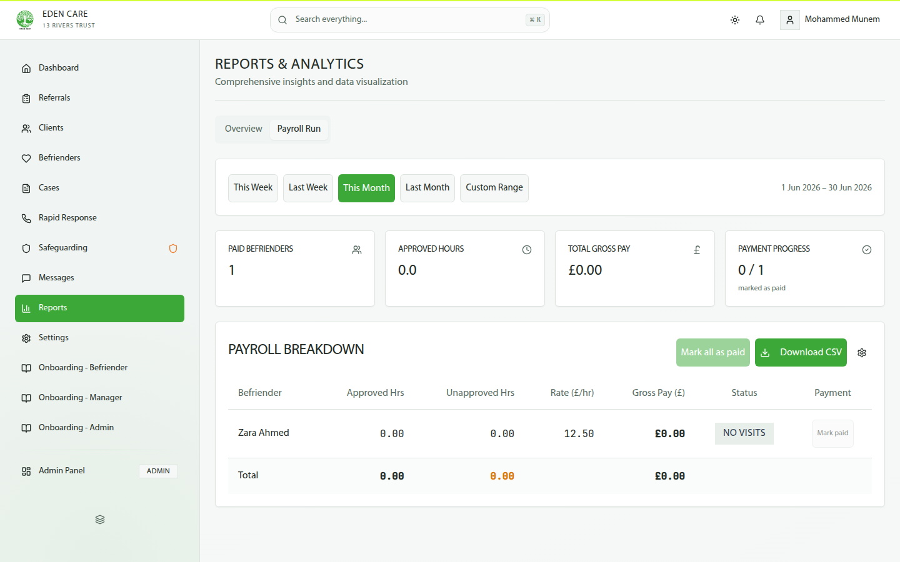

# Befriender User Guide — Eden Care CRM

---

## Timecard & Payroll

> Paid befrienders only. Your profile header shows your rate (e.g. £12.50/hr).

### 1 — Access your timecards

Go to your befriender profile → **TIMECARDS** tab. The tab only appears if you're a paid befriender. Create and submit controls only show when you view your own profile.

### 2 — Create and submit a timecard

1. On your own profile, go to **TIMECARDS**.
2. Click **CREATE THIS WEEK**.
3. A draft timecard auto-builds from your logged visits, showing **TOTAL HOURS** and per-visit breakdown.
4. Once all visits in the timecard are manager-approved, you can submit.

The timecard stays in **DRAFT** until all visits are approved. After submission, it goes to your manager for final approval.

### 3 — Timecard approval

After you submit, your manager reviews and approves the timecard. Approved hours then flow into payroll.

### 4 — Payroll

1. Managers access payroll at **Reports → Payroll Run**.
2. Select the period: This/Last Week, This/Last Month, or Custom Range.
3. View the **PAYROLL BREAKDOWN** table: Befriender, Approved Hrs, Rate/hr, Gross Pay, Status.
4. Use **Download CSV** to export, or **Mark all as paid** to complete the run.

