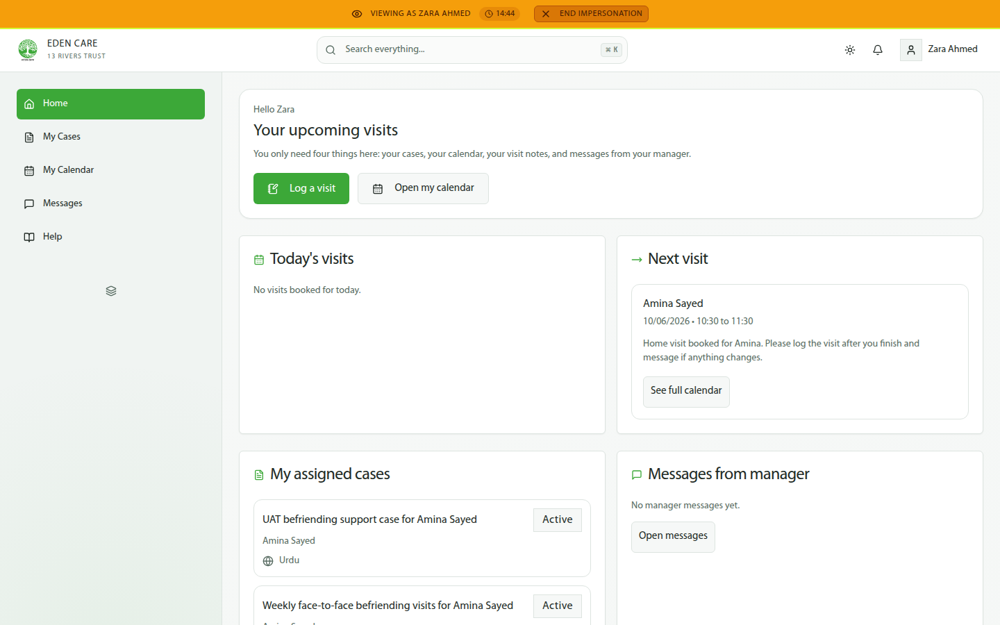
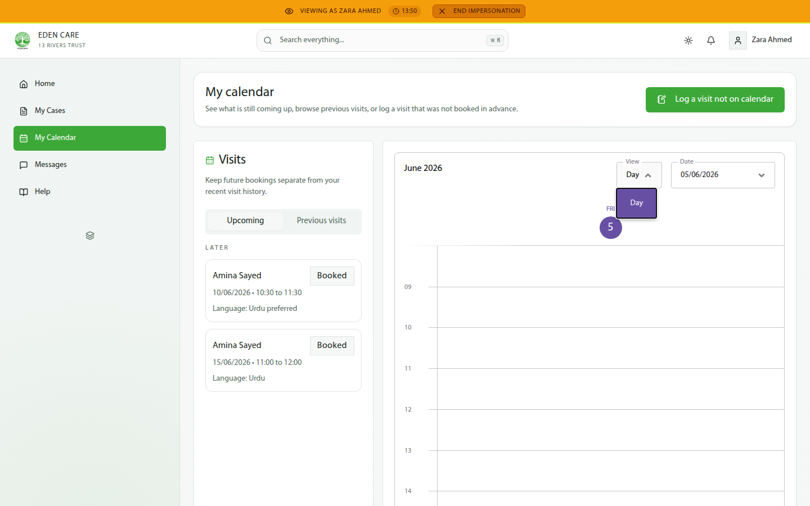
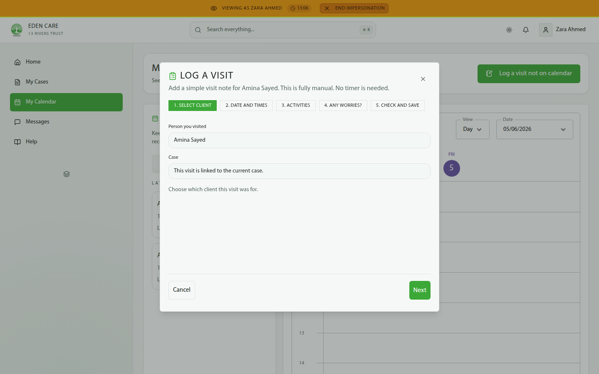
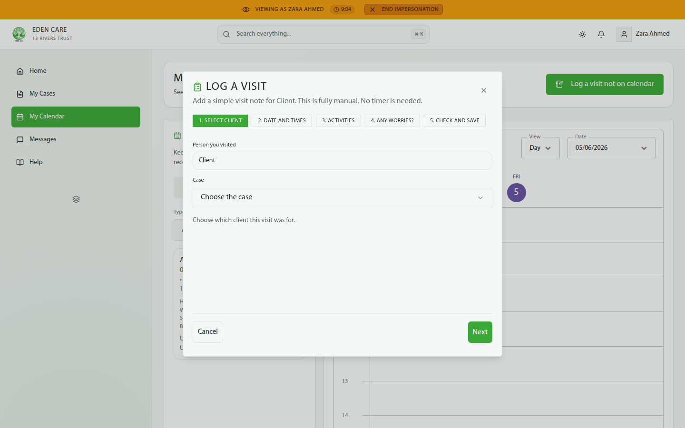
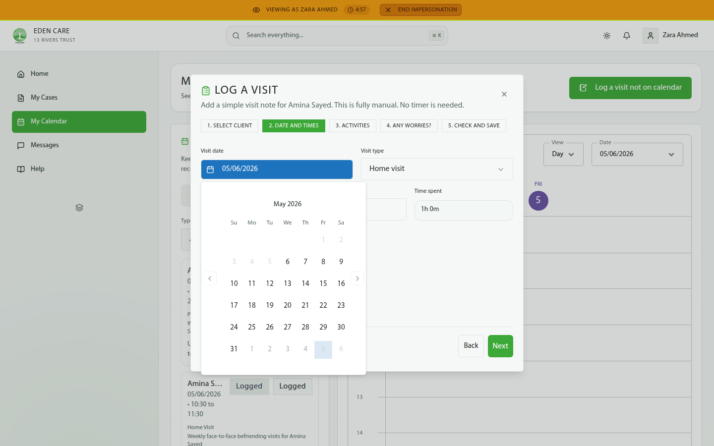
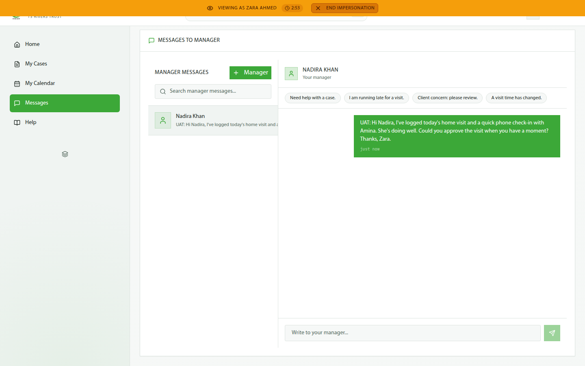
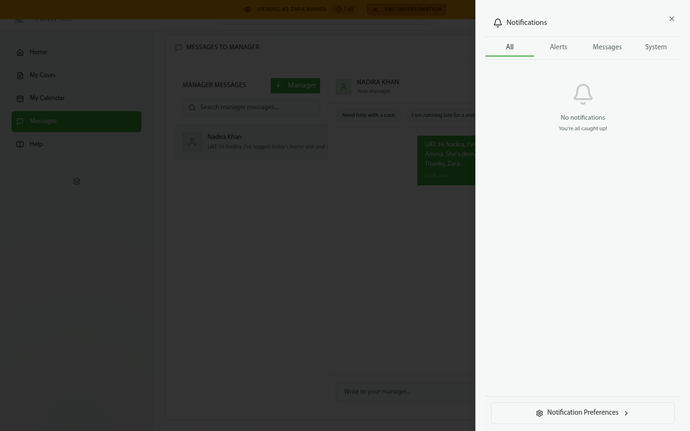

# Befriender User Guide — Eden Care CRM

---

## Day-to-Day Workflow

### 1 — Your home screen

After signing in, you land on your home screen. The sidebar has five items: **Home · My Cases · My Calendar · Messages · Help**.

Your home shows:
- **Today's visits** and your **Next visit** card
- **My assigned cases** (tagged with client language)
- **Messages from manager**
- Quick actions: **Log a visit** / **Open my calendar**

### 2 — My Calendar

Go to **My Calendar** to see all your bookings. The page splits into **Upcoming** and **Previous visits** tabs, with a calendar widget.

### 3 — Log a booked visit

1. Open a booked visit from **Upcoming**.
2. Click **Log this visit**.
3. Follow the 5-step wizard:
   - **Step 1:** Client is pre-linked to the case.
   - **Step 2:** Date & times — auto-clamped to within the 30-day window if needed.
   - **Step 3:** Activities — select activity chips, choose a mood, write a visit note.
   - **Step 4:** Any worries? — toggle the manager follow-up flag, select help-requested tags.
   - **Step 5:** Summary — check and save.
4. Click **Save**.

The visit moves from **Upcoming** to **Previous visits** with status **Logged**. It's now ready for manager approval.

### 4 — Log an off-calendar visit

1. From **My Calendar**, click **Log a visit not on calendar**.
2. Choose the case (since there's no booking to anchor to).
3. Select the visit type: **Home visit · Phone call · Video call · Accompanied outing**.
4. Complete the same 5-step wizard and save.

Off-calendar visits appear in **Previous visits** without the "Booked in calendar" tag, distinguishing them from booked visits.

### 5 — Back-date a visit

The date picker in the log-visit wizard enforces a **30-day window**. You can log visits up to 30 days in the past. Dates outside this range are disabled in the picker.

### 6 — Message your manager

1. Go to **Messages** in the sidebar.
2. Click **+ Manager** and pick your manager.
3. Use quick-reply chips or type a free-text message.
4. Press Enter or click send.

Quick-reply chips: "Need help with a case.", "I am running late for a visit.", "Client concern: please review.", "A visit time has changed."

### 7 — Notifications

Click the **bell icon** in the header to open the Notification Centre. Tabs: **All · Alerts · Messages · System**. Use **Notification Preferences** to configure.

### 8 — Raising a safeguarding concern

The dedicated Safeguarding module is **not available to befrienders** — it redirects you back to your dashboard if you try to access it.

To escalate a concern: use the **"Did anything need manager follow-up?"** flag in the visit-log wizard (Step 4). This routes the issue to your manager.
