# Manager User Guide — Eden Care CRM

---

## Journey 2 — Referral → Client → Case → Match

### 2.1 — Create a referral

1. Go to **Referrals** in the sidebar.
2. Click **New Referral**.
3. Fill in the tabs: **Referrer** → **Personal** → **Contact** → **Demographics** → **Health** → **Support** → **Consent**.
4. Select a **Referral Source** (e.g. GP/Healthcare) — mandatory.
5. Click **Create Referral**.

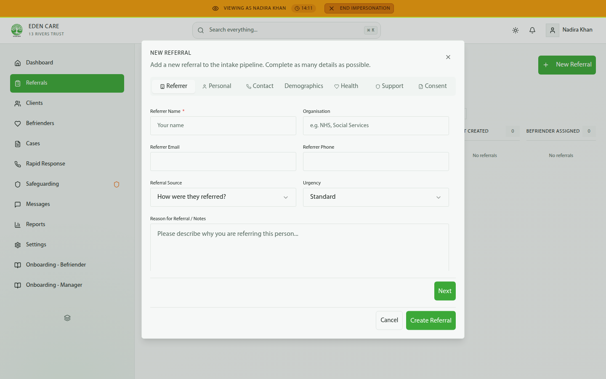

The referral appears in the **Received** column of the pipeline. Each tab shows a badge when complete. The consent tab requires GDPR data-processing consent and next-of-kin details.

### 2.2 — Advance referral through pipeline stages

1. Drag a referral card from one pipeline column to the next.
2. A **Move Referral** dialog opens — write a note explaining the stage transition.
3. Click **Confirm Move**.

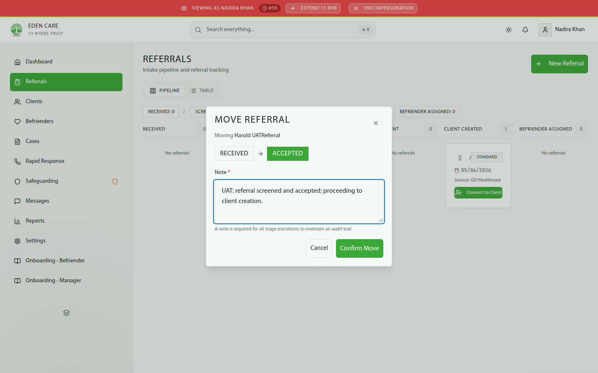

The move persists across reload. Column labels ("Client Created", "Befriender Assigned") map to status values ("Accepted", "Matched").

⚠️ If you don't confirm in the dialog, the move silently reverts on reload.

### 2.3 — Convert referral to client

1. Once the referral reaches the **Client Created** column, click **Convert to Client** on the card.
2. Review the pre-filled form — all referral data carries over.
3. Click **Create Client**.

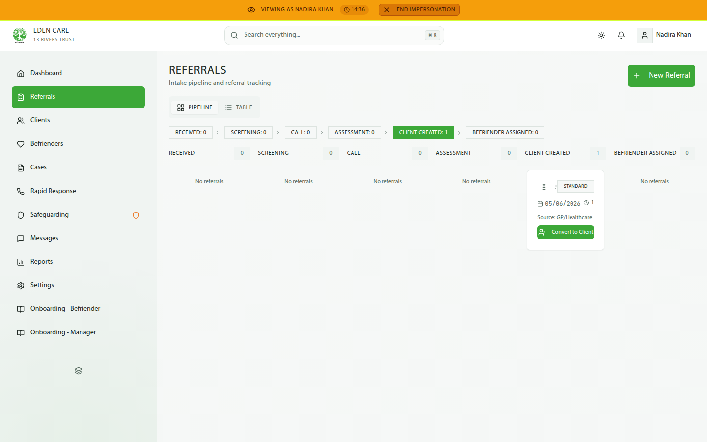

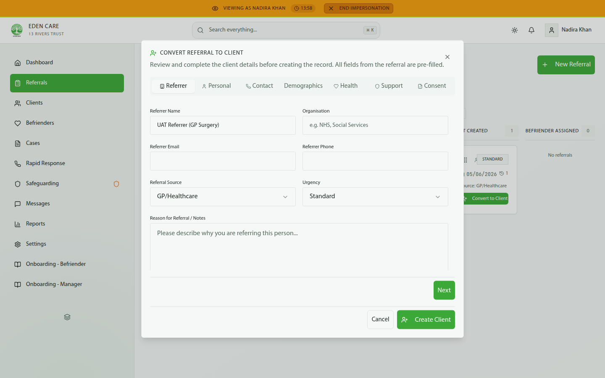

The new client appears in the client directory.

### 2.4 — Add a client directly

1. Go to **Clients** in the sidebar.
2. Click **Add Client**.
3. Fill in the tabs: **Personal** → **Contact** → **Demographics** → **Health** → **Support** → **Consent**.
4. Required fields: First/Last name, DOB, Phone, Address, Postcode, Next-of-kin, **Support Types**, and Data Processing Consent.
5. Click **Create Client**.

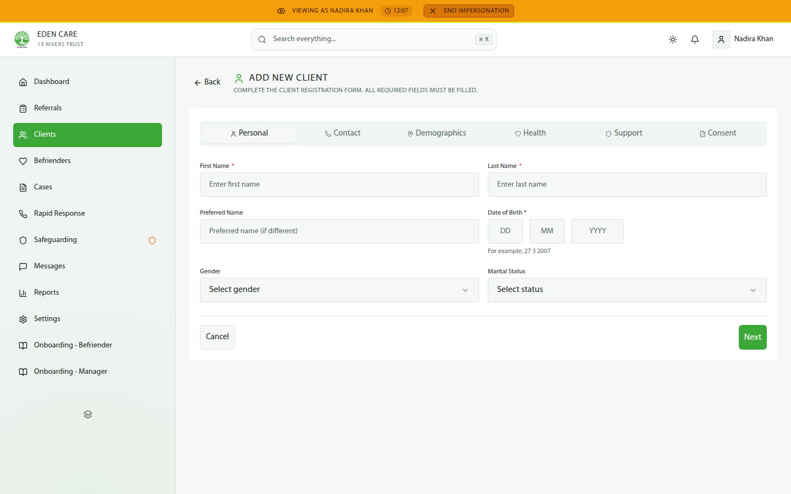

If any required field is missing, the form shows a **"There is a problem"** error with a jump link to the field.

### 2.5 — Create a case

1. Go to **Cases** in the sidebar.
2. Click **New Case**.
3. Enter a **Case Title**, the **Client Name**, and select **Case Types** (e.g. Befriending).
4. Optionally set priority, status, and a next-action note.
5. Click **Create Case**.

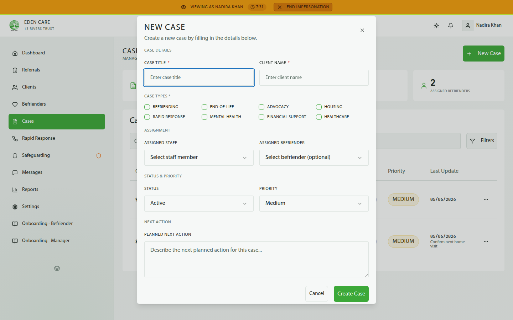

The case appears in the cases list. Refresh the page if it doesn't show immediately.

### 2.6 — Find suggested matches

1. Open the client's profile.
2. In the **MATCHING** card, click **Find Matches**.
3. Select the case to find befrienders for.

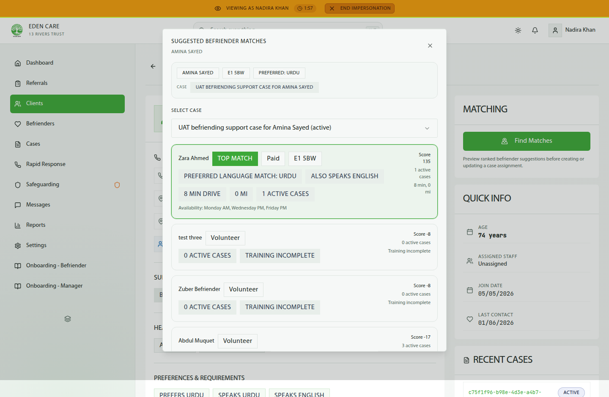

The matching engine returns a ranked, scored list. Factors: language match, travel distance, training/DBS status, and current caseload. The top match is shown first with their score and key attributes.

### 2.7 — Assign a befriender

1. In the match results, select the befriender you want.
2. Click **Assign Befriender**.

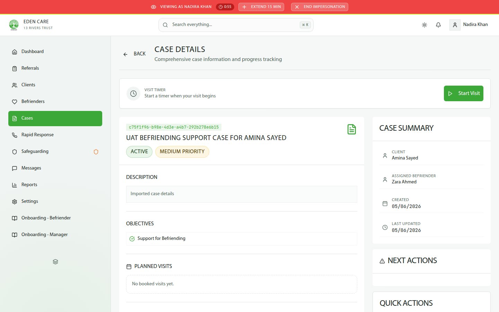

The case profile now shows **ASSIGNED BEFRIENDER** with their name. If the befriender has valid DBS and complete training, assignment is direct.

### 2.8 — Book a visit

1. On the case, go to **Quick Actions → BOOK VISIT**.
2. The assigned befriender and client language preference are pre-filled.
3. Set the **date** and **times**.
4. Choose the visit type (Home visit, Phone call, Video call, Accompanied outing).
5. Click **Book visit**.

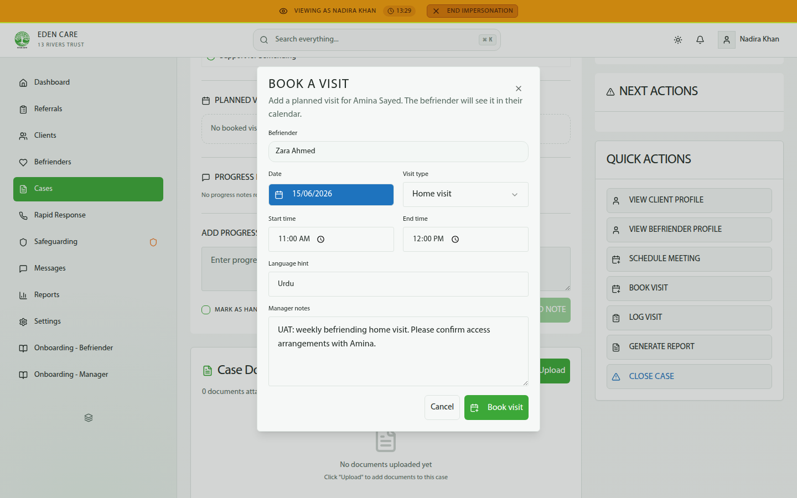

The booked visit appears under the case's **PLANNED VISITS** section.

---

## Journey 3 — Client Profile Management

### 3.1 — Edit client details

1. Go to **Clients** in the sidebar.
2. In the client list, click the row menu → **Edit Client**.
3. Update any details across the tabs.
4. Click **Save Changes**.

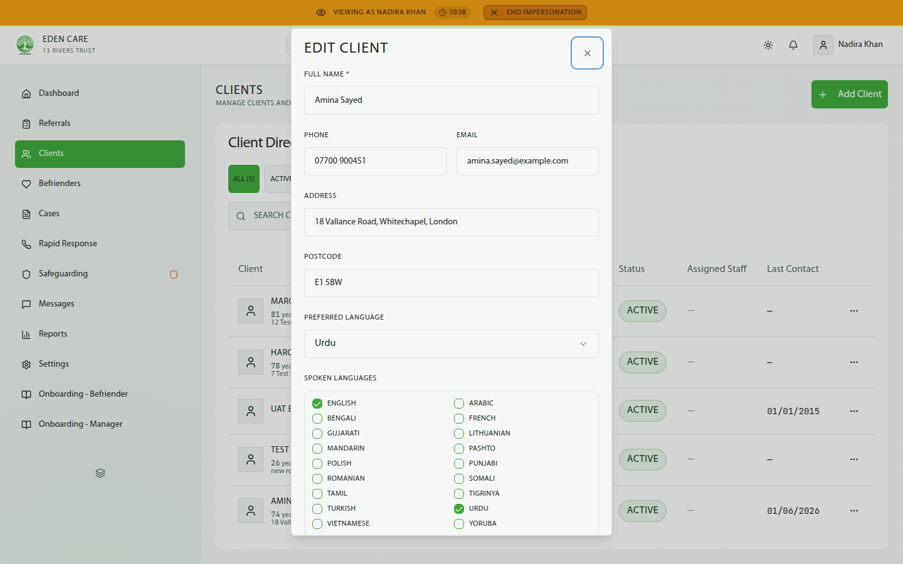

Changes persist immediately. The edit dialog also exposes the **Safeguarding Flag** toggle and **Risk Notes** section.

### 3.2 — Add a risk note

1. Open **Edit Client** on a client.
2. Go to the **Risk Notes** section.
3. Choose a category: **Safeguarding · Medical · Access · Behavioural · Other**.
4. Type a description and click **Add item**.
5. Click **Save Changes**.

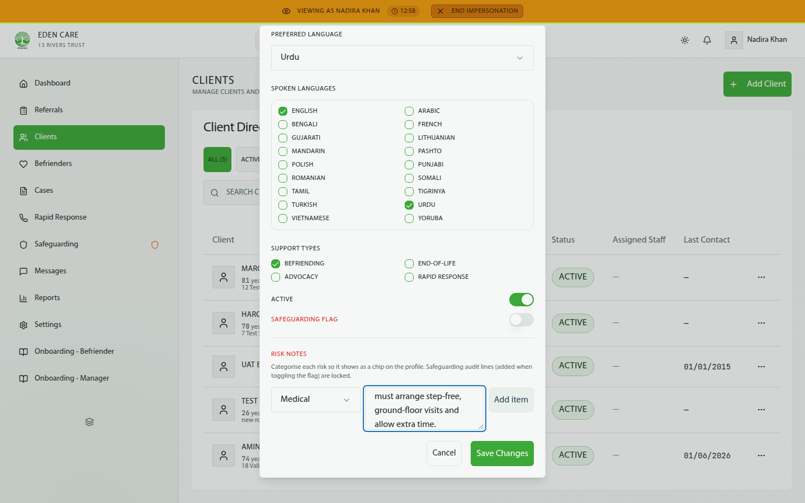

The risk note appears on the client profile with author name, date, and category.

### 3.3 — Toggle safeguarding flag

1. Open **Edit Client** on a client.
2. Toggle the **Safeguarding Flag** switch.
3. A confirmation dialog appears — **a reason is mandatory**.
4. Type the reason and click **Add flag**.
5. Click **Save Changes**.

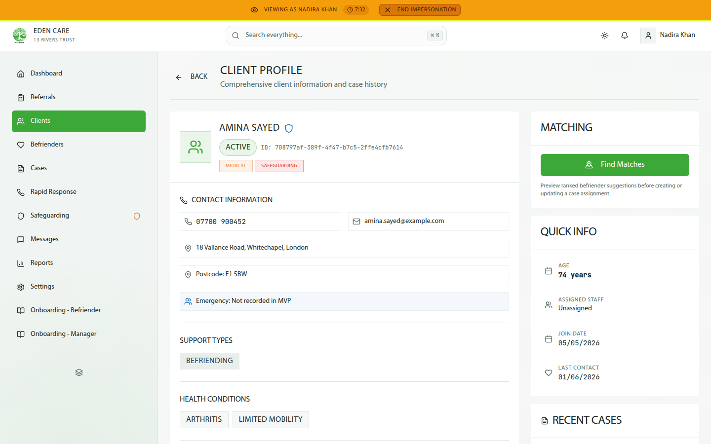

The profile then shows a shield icon beside the client name and a Safeguarding summary chip. Both add and remove actions are locked as audit records in the risk notes — the full history of flag changes is preserved.

### 3.4 — Add a support plan goal

1. On the client profile, go to the **Support Plan** tab.
2. Click **Add Goal**.
3. Enter a **Goal Title** (required) and description. Optionally set a target date.
4. Click **Add Goal**.

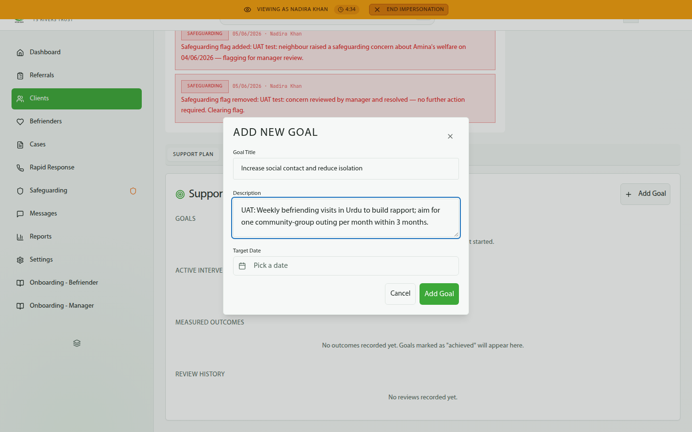

The goal appears under **GOALS** with a progress bar and **NOT STARTED** status. The Support Plan has four sections: Goals, Active Interventions, Measured Outcomes, and Review History.

### 3.5 — Manage consent

1. On the client profile, go to the **GDPR & Consent** tab.
2. Toggle the seven consent switches as needed:
   - Data Processing, Photo/Media, Third Party Sharing (NHS), Third Party Sharing (Local Authority), Newsletter & Updates, Emergency Contact Sharing, WhatsApp Communications.
3. Changes save automatically with a success toast.

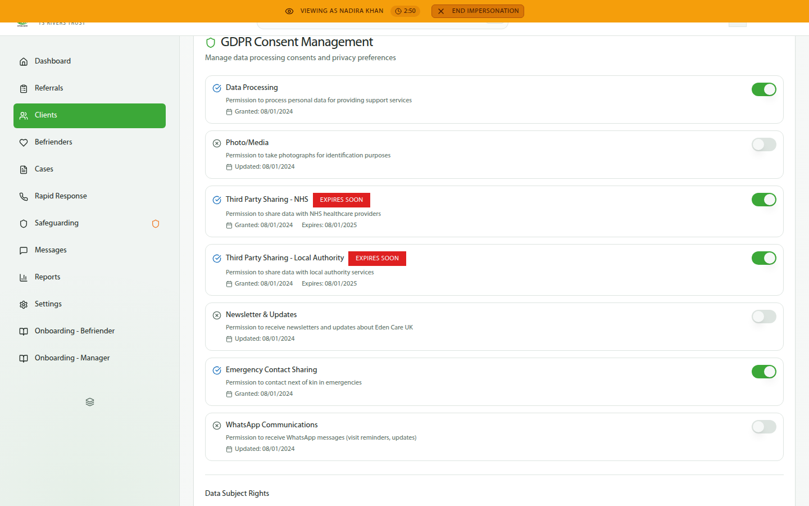

The **Data Subject Rights** section offers **Request Data Export (SAR)** and **Request Data Deletion**. Consent changes are written to the audit trail.

---

## Journey 5 — Case Management & Oversight

### 5.1 — Approve a visit

1. On the dashboard, find the **Pending Visit Approvals** card.
2. Click **Approve** on a pending visit.
3. Add a check-note in the confirmation dialog.
4. Click **Confirm Approval**.

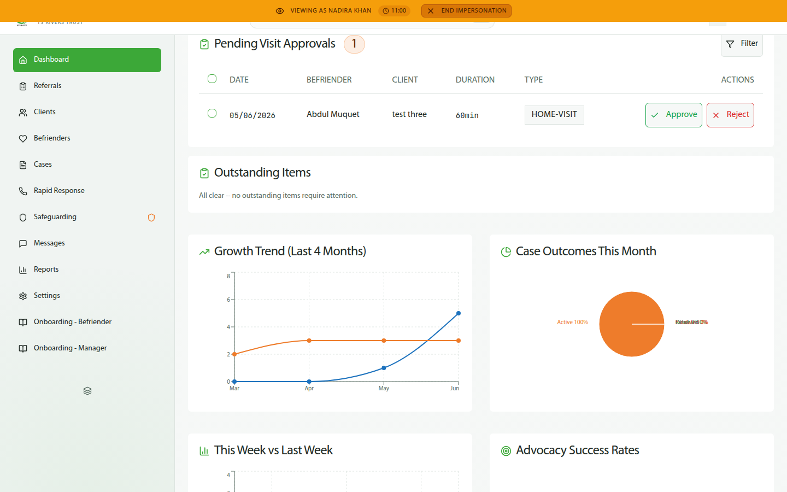

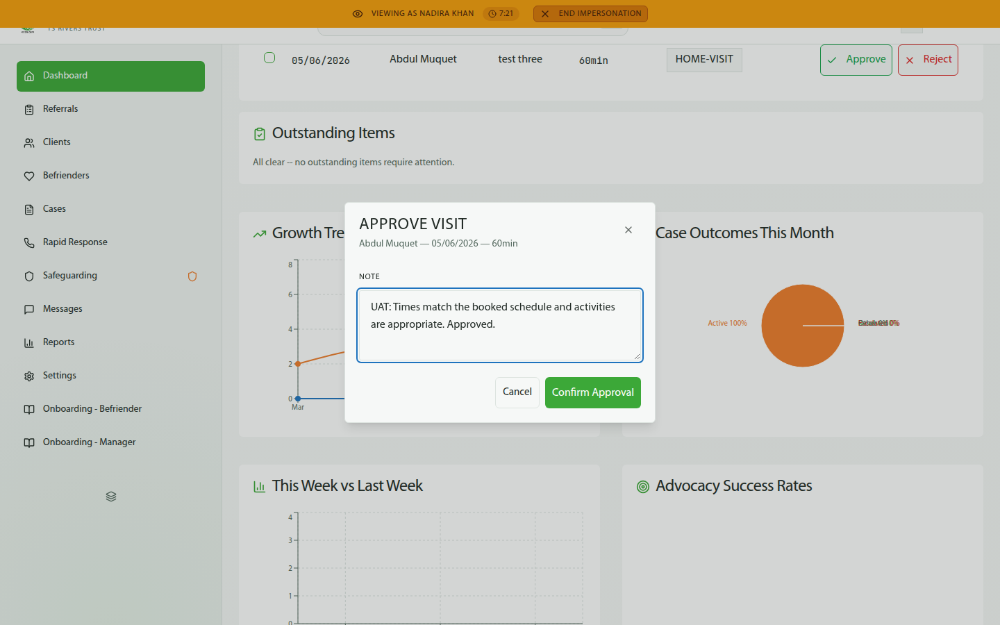

The visit leaves the queue and the count decreases. Approved visits feed into the timecard and payroll system.

### 5.2 — Reject a visit

1. On the **Pending Visit Approvals** card, click **Reject**.
2. Type a rejection reason — mandatory.
3. Click **Confirm Rejection**.

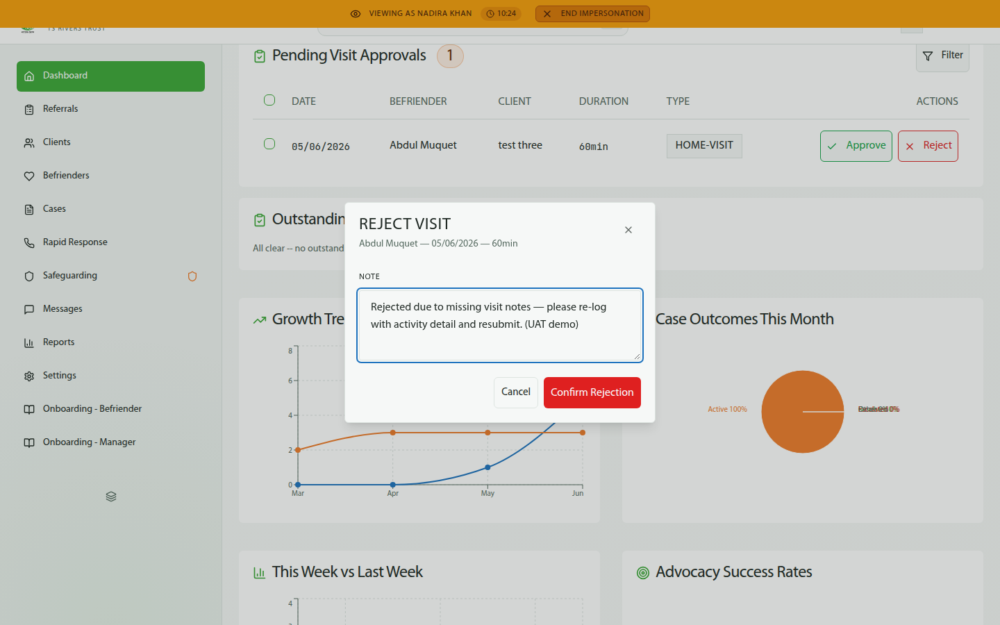

The reason is recorded for audit purposes.

### 5.3 — Flag a visit for review

1. On the **Pending Visit Approvals** card, click **Flag** on a visit row.
2. The row flips to a **Flagged** badge.

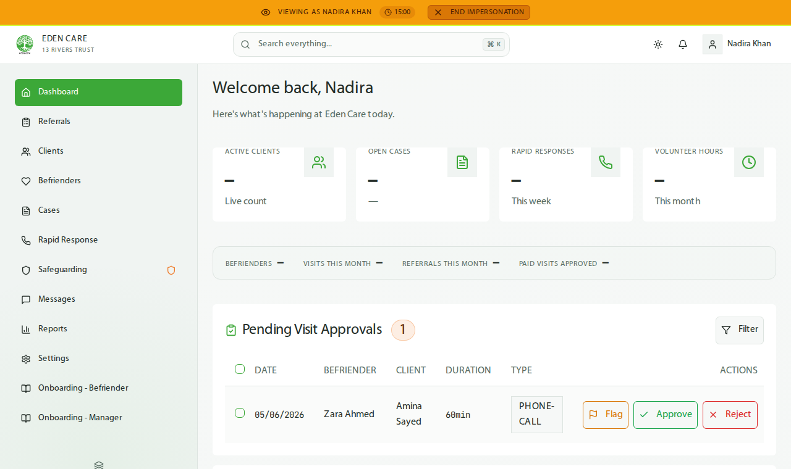

### 5.4 — Add a case note

1. On the case, go to **ADD PROGRESS NOTE**.
2. Write the note. Optionally tick **Mark as handover note** (pinned for 14 days).
3. Click **ADD NOTE**.

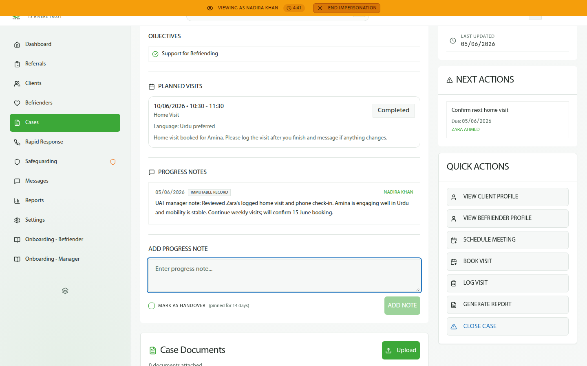

Notes are saved as **IMMUTABLE RECORDS** — append-only with automatic author and timestamp. They cannot be edited or deleted.

### 5.5 — View case chronology

The **CASE CHRONOLOGY** section on the case automatically aggregates all events into a dated timeline: visits logged, notes added, status changes. Use **Add Entry** to manually add an item.

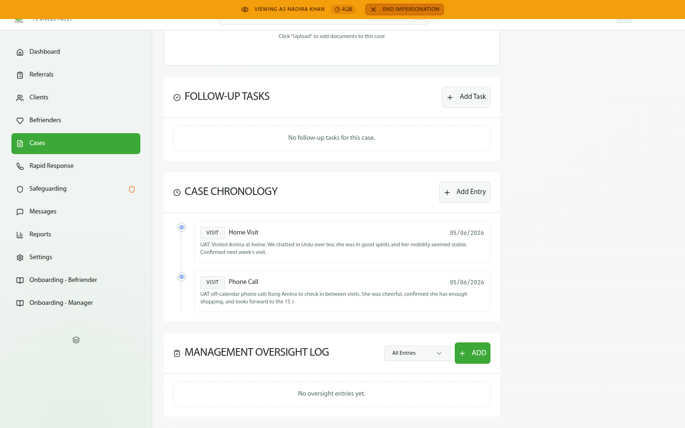

### 5.6 — Create a follow-up task

1. On the case, go to **FOLLOW-UP TASKS → Add Task**.
2. Enter a **Description** (required), Due Date, Priority, and Assignee.
3. Click to create.

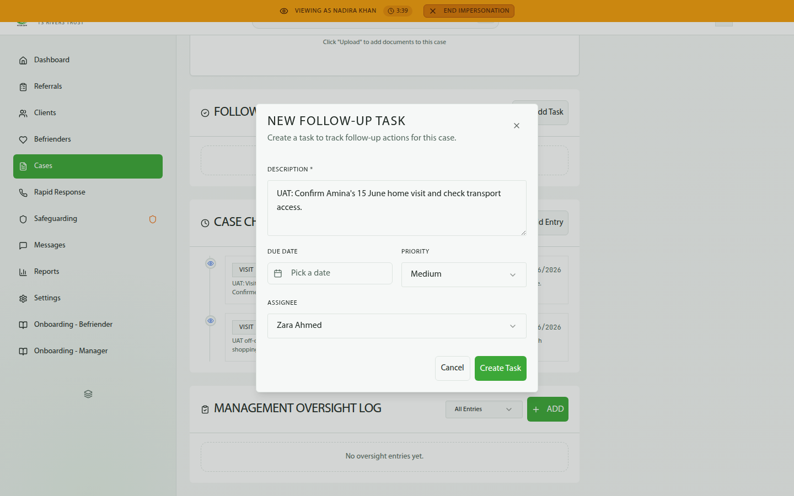

Click **Start** to begin a task, **Done** to mark it complete (shows strikethrough + completed badge).

### 5.7 — Add a management oversight entry

1. On the case, go to **MANAGEMENT OVERSIGHT LOG → ADD**.
2. Fill in: **Review Date**, **Summary** (required), Decisions, Reasons, Advice to Volunteer, Follow-up Actions, Follow-up Due Date.
3. Click **SAVE ENTRY**.

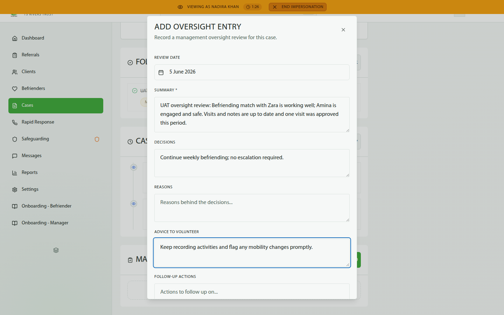

The entry appears as **OPEN · BY [your name]** and feeds the dashboard's "Open oversight entries" KPI.

### 5.8 — Amend a scheduled visit time

1. Go to the befriender's **Visit History** list.
2. Find the booked visit and use the amend control to reschedule.

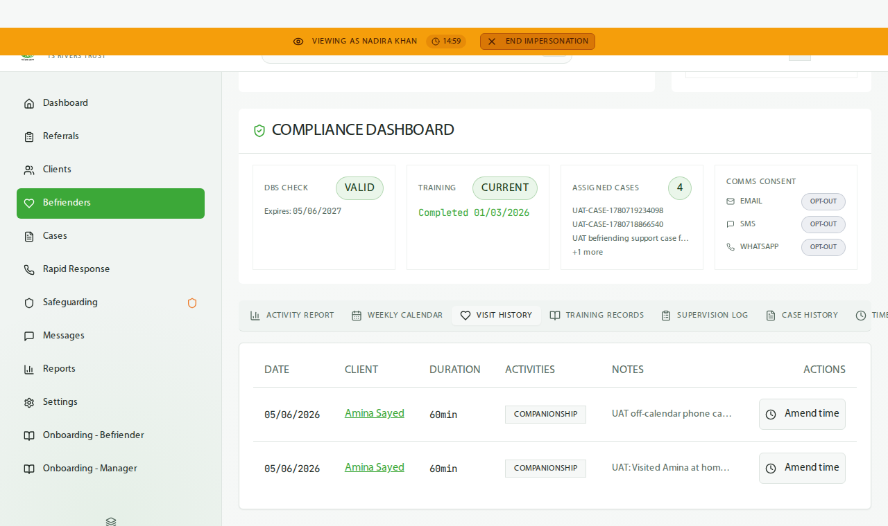

### 5.9 — Upload a document

1. On the case, go to **Case Documents → Upload**.
2. Drop a file into the upload zone (PDF, DOCX, XLSX, JPG, PNG — max 10MB).
3. The document uploads and appears in the case's document list.

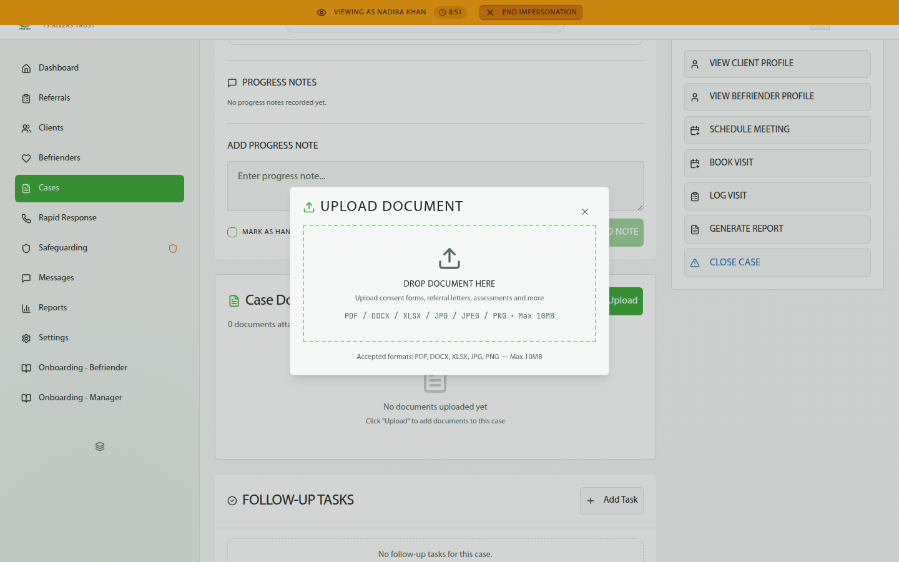

### 5.10 — Close a case

1. On the case, click **CLOSE CASE**.
2. **Step 1:** Choose Closure Reason, Outcome Status, and Goals-Met level. If there are pending visits, closure is blocked.
3. **Step 2:** Record client feedback (optional).
4. **Step 3:** Tick all 4 items in the **mandatory checklist**. The **Close Case** button only enables once everything is checked.
5. Click **Close Case** to finalize.

⚠️ **Closing is irreversible.** Once closed, the case becomes read-only and cannot be reopened.

---

## Journey 8 — Reports & Exports

### 8.1 — Reports dashboard

1. Go to **Reports** in the sidebar.
2. Use the date-range selector (Current Month / Last Month / This Quarter / This Year) to filter.

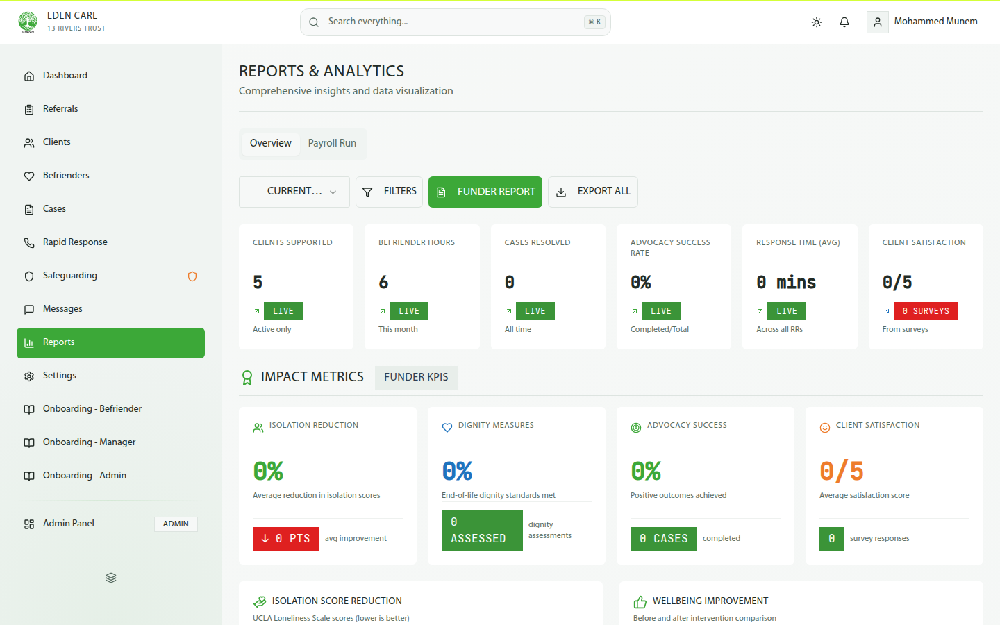

The dashboard shows KPI cards, impact metrics, and charts (Isolation Score Reduction, Wellbeing Improvement, Client Satisfaction by Service Type).

### 8.2 — CSV export

From the **Payroll** tab, click **Download CSV** to get a payroll CSV with columns: Name, Email, Period, Approved Hours, Hourly Rate, Gross Pay, Paid status.

### 8.3 — Funder report

1. Click **FUNDER REPORT** on the Reports overview.
2. Follow the 3-step wizard: pick Reporting Period → Select Funder → Select Metrics.

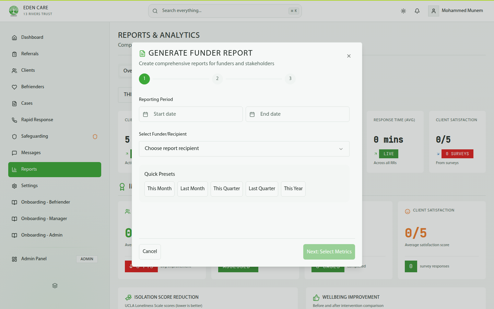

### 8.4 — Impact summary

The **IMPACT METRICS** block on the Reports overview shows Isolation Reduction, Dignity Measures, Advocacy Success, and Client Satisfaction — designed for funder-facing reporting.

### 8.5 — Financial records

1. Go to **Financial** in the sidebar.
2. Click **Add Entry** — fill in Entry Type, Date, Amount, Source, Purpose.
3. Click **Export CSV** to download a financial records file.

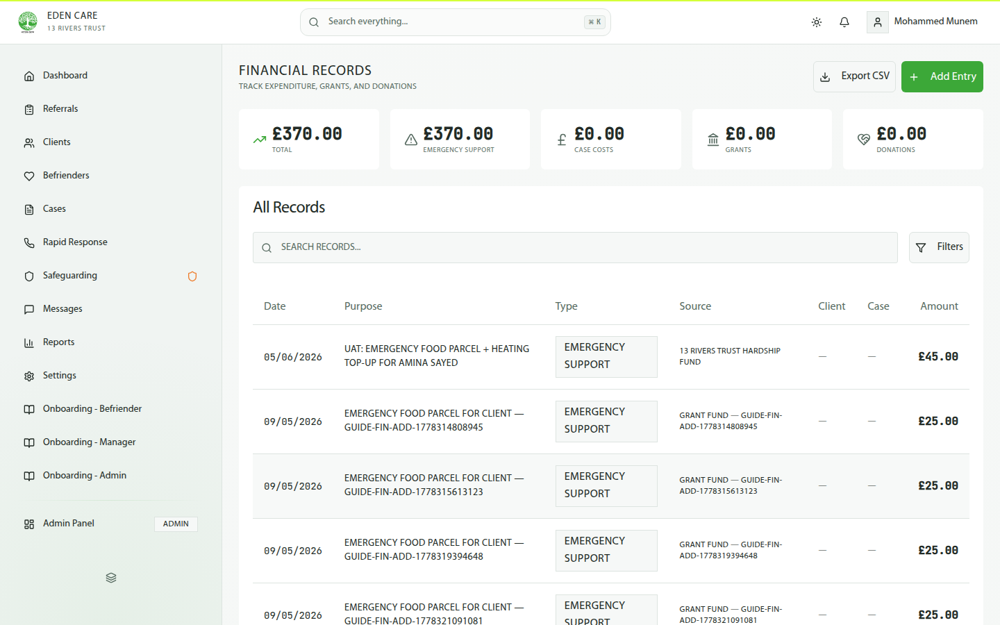

### 8.6 — Full database export

1. Go to **Settings → Data Management**.
2. Click **Full Database Export**.
3. A ZIP file downloads containing per-table CSVs (clients, cases, visits, profiles, advocacy, rapid responses, referrals).

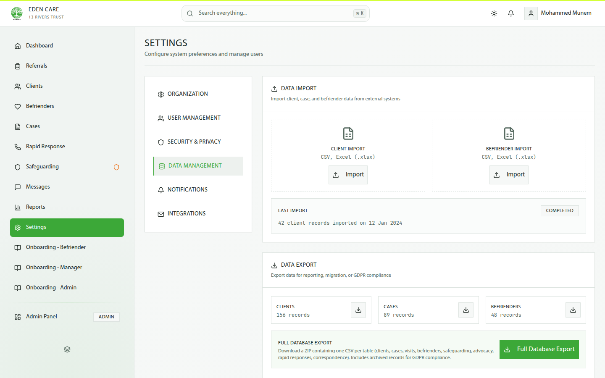

### 8.7 — Export controls

All export cards on the reports surface are labelled **CSV** and produce real downloads. Working exports: Full Database Export ZIP, Payroll CSV, Financial CSV.
